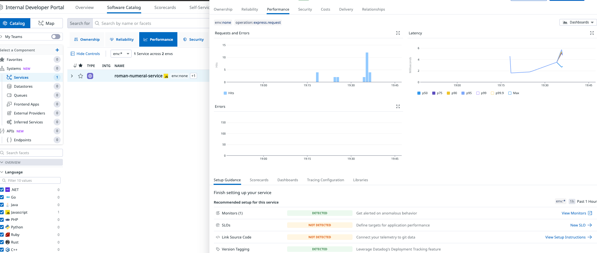
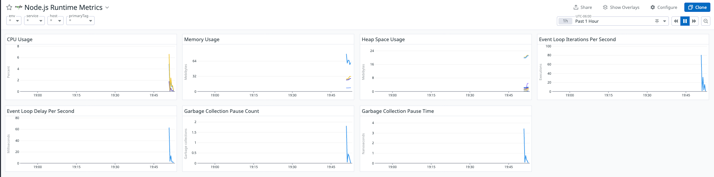
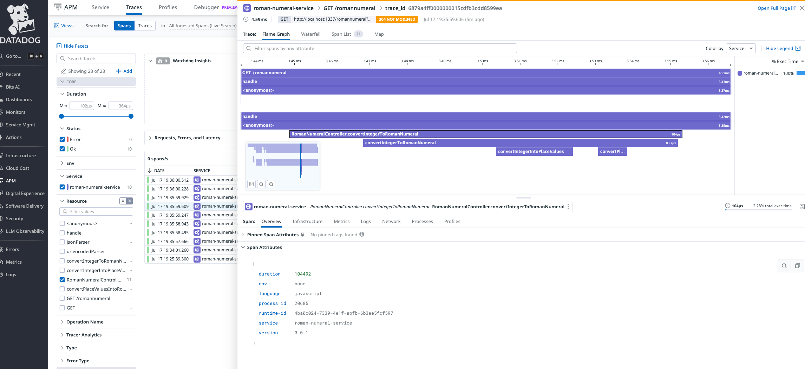
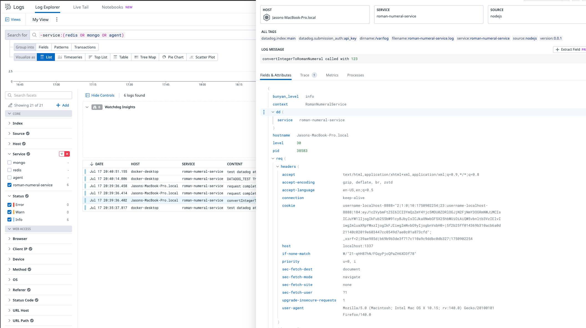
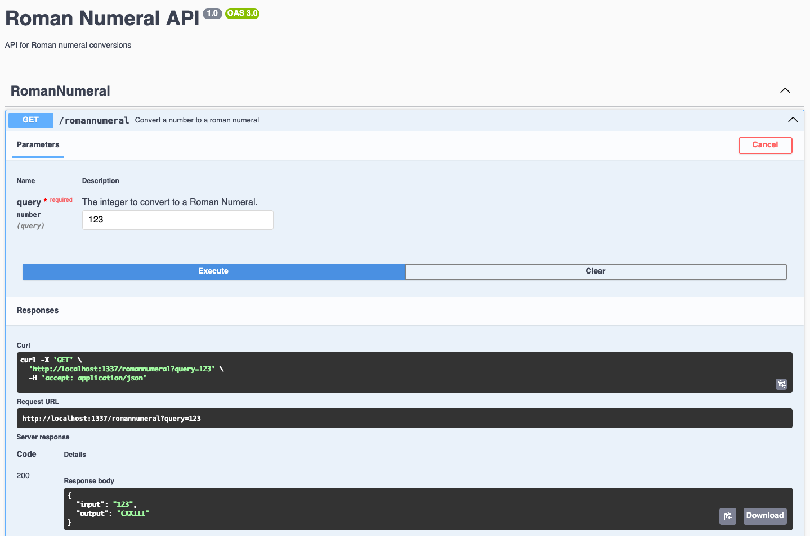

# Roman Numeral Service
Webservice that is primarily concerned with operations related to Roman numerals, such as converting integers to Roman numerals.

## Quick Validation
```shell
make docker-run
curl "http://localhost:3000/romannumeral?query=123"
# Replies with: {"input":"123","output":"CXXIII"}
make docker-stop
```

## Project Structure
The project uses a layered architecture, with separation of concerns broken down into services, controllers, models, repositories, etc.

### Controllers
Responsible for encapsulating http.  Wire up incoming request validation, and communicate with the service layer.

### Services
Contain business logic, and orchestration with repositories, models, and other services.

### Models
Primarily data contracts for both internal types (errors, interfaces, classes, etc), and our api (requests, responses).

### Schemas
Zod schemas used in validating incoming requests, provide appropriate error messaging, etc.

### Repositories
Not needed yet in this project, but this is where we encapsulate db interactions for CRUD operations.

## Dependencies

### Nest.js
Nest.js is a modular framework built in TypeScript on top of Express, which is decorator-driven, allowing us to declaratively define behavior and structure for our classes, methods, and properties.

### DataDog
We use DataDog to accomplish the objective of 3 pillars of observability: Metrics, Logs, Traces

#### Dashboards

##### Services Explorer
We can see our roman numeral service's requests, errors, p99, p50, etc latency


##### Runtime Metrics
We can see our cpu usage, memory usage, heap space, garbage collection pause time, etc on the Node Runtime Metrics Dashboard.


##### Traces Explorer
We can see our spans (convertIntegerToRomanNumeral, etc) in the APM Traces Explorer, along with breakdowns of each span we created in the code.


##### Logs Explorer
We can see our logs from our service, including log messages, request headers, etc


### nestjs-ddtrace
Makes it easier to integrate nestjs and DataDog

#### span
A span is a granular, traceable record of an operation in our code.
They help us visualize, measure, and diagnose individual steps with a distributed request, giving us end to end observability.

##### tag
A key value pair of metadata added to a span, which allow us to attach additional info that is searchable. 
e.g. user ids, request params, operation types, or results.

### nestjs-pino
Platform agnostic logger for nestjs, base on Pino, with request context in every log.

### OpenAPI/Swagger
By using OpenAPI, we ensure downstream services, uis, and other may communicate with our service via a well defined contract.

For example, the roman-numeral-ui generates it's client using the generated open-api spec.

We use swagger annotations to decorate our controllers and models, so that we may generate the openapi spec from code.  This helps ensure our code and spec stay in sync.

#### OpenAPI spec generation
The OpenAPI spec is generated when we start the service, and written to src/roman-numeral-openapi-spec.json

#### API Docs
The api docs can be viewed a the /api endpoint, and allow for viewing and trying out the various endpoints.
http://localhost:1337/api


## Dev Setup
Install node.js and dependencies
```shell
brew install node
npm install
```

## Tests
Our project has unit and integration tests for ensuring our service functionality is correct.

Run tests using:
```shell
npm run test
npm run test:unit
npm run test:integration
```

### Unit
Our unit tests test our services functions, and other business logic, so we can validate relatively complex business logic.

### Integration
Integration tests ensure the service actually behaves correctly when running.  
Often times in unit tests we have to mock out key pieces of functionality, and are unable to validate the service as a whole works as expected.

Our integration tests use the client we generate from our openapi specs to call endpoints on a running instance of the service.

In them, we ensure our outputs are correct, and our error codes return the expected error details.

Note: integration tests need a running service to communicate with (eg. your local running service, or a test environment)

## Running The Service
To run the service locally, run:
```shell
npm run start:dev
```

### Running with Docker
The service is now fully containerized with Docker support. 

#### Quick Start with Docker
```shell
# Start
docker-compose up --build

# Stop
docker-compose down
```

For additional docker documentation and convenience , reference the [Makefile](Makefile)

#### datadog agent
If you want local spans, logs, etc to go to datatog, you'll need to run the datadog-agent container

##### conf.d
Log configurations passed to datadog when running docker compose.  see [docker-compose.yml](docker-compose.yml)

##### datdog.yaml
Datadog config passed to datadog when running docker compose.

##### Misc 
Useful command to see if APM, Logs, etc are running and receiving input:
```shell
docker exec -it dd-agent agent status
```

## Client Generation
To help ensure our service behaves as expected, as well as ensure our schemas are properly defined, we generate a typescript client
from our generated roman-numeral-openapi-spec.json, and the run tests using the generated client.

### Generating the Client

```shell
npm run generate-client
```
The generated client can be found under src/clients/roman-numeral-client
